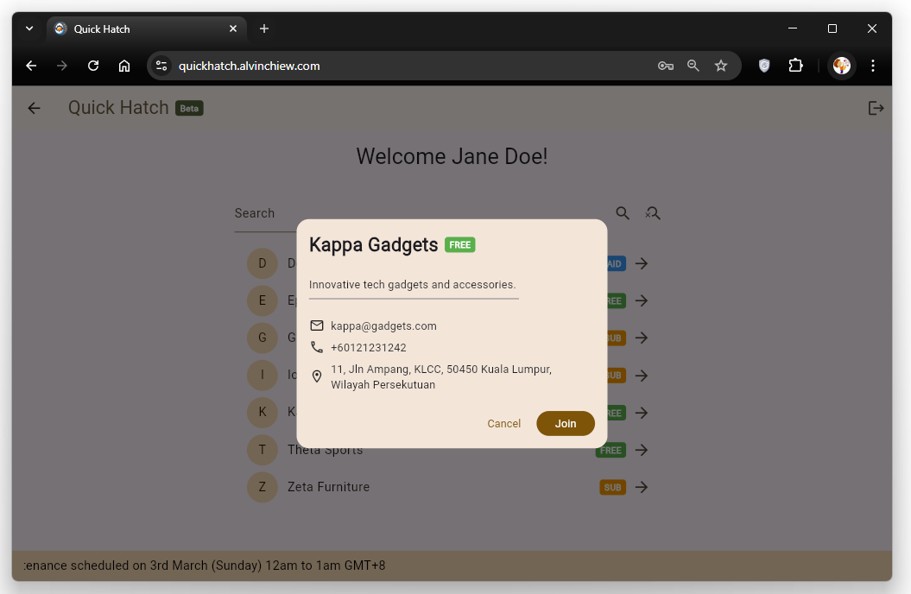
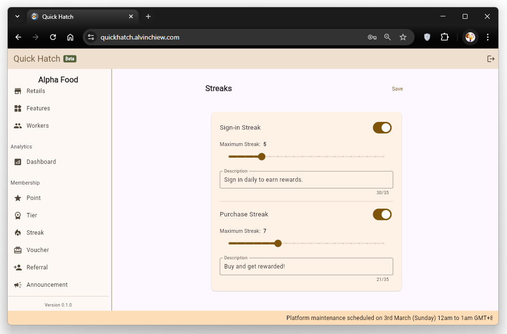

# Quick Hatch - Membership Platform 🐣

<!-- 🚧 Work in progress 🚧 -->

An online platform for merchants to create brand loyalty programs to boost customer engagement and retention, fast and easy!

Features and programs are modularized for rapid launches and customizable to cater each businesses. This application is built with Flutter, with a plan to share the same code base for a mobile app.

## Tech Stack

- Front End: Flutter
- Back End: Fast API
- Database: SQLite / Postgres
- Data Modeler: dbdiagram.io
- CI/CD: Docker, Github Action
- OS: Ubuntu Server
- Network: Cloudflare Tunnel

## Application

### User

User Authentication

User Sign Up

User Forgot Password

User Reset Password Email

User Reset Password

### Membership

Select Membership

Join Membership

Preview Program

Membership Homepage

Member Edit Profile

Membership Point History

Membership Redeem Voucher

Membership Collect Voucher

Membership Voucher History

Membership Streak

Membership Redeem Streak

Membership Tier Benefits

### Retail

Select Retail

Retail Feature Toggle

Retail Worker Setup

Retail Point Award

Retail Point History

Retail Voucher

Retail Tier

Retail Streak

Retail Referral

Retail Announcement

Retail Dashboard

### Worker

Worker Select Retail

Worker Award Point

Worker Point History

### Admin

Admin Retail Management

## LICENSE

Copyright (C) Alvin Chiew - All Rights Reserved

Unauthorized usage of this software and associated documentation files (the "Software") including the rights to use, copy, modify, merge, publish, distribute, sublicense, and/or sell copies of the Software, via any medium, is strictly prohibited. The above copyright notice and this permission notice shall be included in all copies or substantial portions of the Software.

Proprietary and confidential.

THE SOFTWARE IS PROVIDED "AS IS", WITHOUT WARRANTY OF ANY KIND, EXPRESS OR
IMPLIED, INCLUDING BUT NOT LIMITED TO THE WARRANTIES OF MERCHANTABILITY,
FITNESS FOR A PARTICULAR PURPOSE AND NONINFRINGEMENT. IN NO EVENT SHALL THE
AUTHORS OR COPYRIGHT HOLDERS BE LIABLE FOR ANY CLAIM, DAMAGES OR OTHER
LIABILITY, WHETHER IN AN ACTION OF CONTRACT, TORT OR OTHERWISE, ARISING FROM,
OUT OF OR IN CONNECTION WITH THE SOFTWARE OR THE USE OR OTHER DEALINGS IN
THE SOFTWARE.
